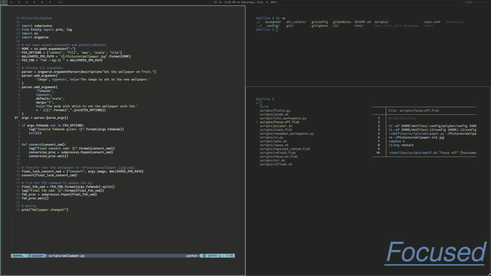

# .files (dotfiles)

These are my dotfiles. They apply to my Linux machines mostly, but there may be
some hacky artifacts from my short stint on OS X and/or WSL.

### Screenshot(s)
Here's a simple GIF showing the two 'modes' my environment can be in:

* **Normal** - What I usually use. It's pretty, but tries to stay as practical as it can.
* **Focused** - Avoids caring about aesthetics and goes for as minimal as it can. 
Frees up distractions. I use this when I'm working on something hard or I'm stressed.

_fun fact_: The original dotfiles repo that this was cloned from used to have
600+ commits.
